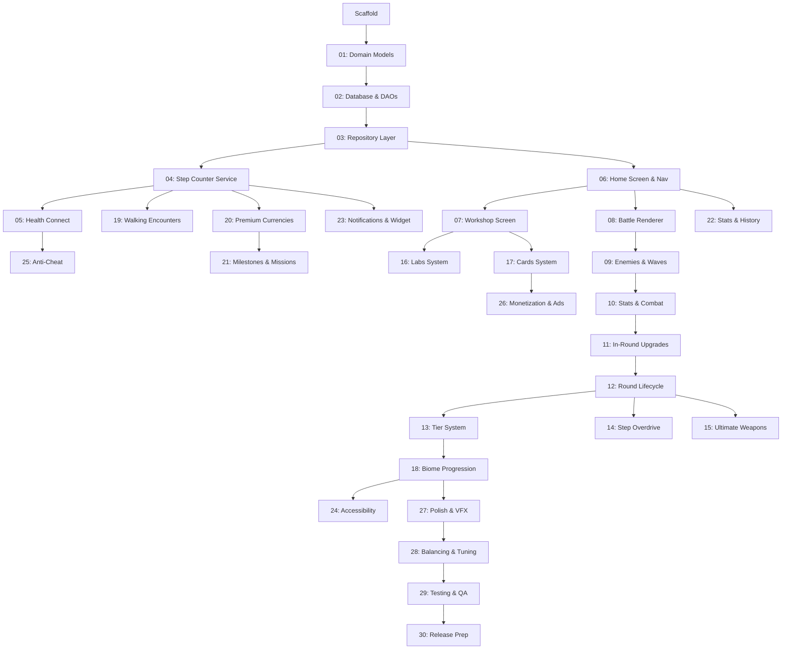

# Master Plan — Steps of Babylon v1.0

This document defines the ordered sequence of sub-plans required to bring Steps of Babylon from its current scaffold to a complete v1.0 release. Each plan is a self-contained chunk of work that builds on the previous ones. Plans should be executed in order.

See `docs/StepsOfBabylon_GDD.md` for the full game design document.

---

## Plan Index

| # | Plan | Description | Dependencies |
|---|---|---|---|
| 01 | [Domain Models & Currency System](./plan-01-domain-models.md) | Define all core domain models (currencies, upgrade types, tier config, enemy types) and the cost calculation engine. Pure Kotlin, no Android deps. | Scaffold |
| 02 | [Room Database & DAOs](./plan-02-database.md) | Create all Room entities, DAOs, and the database migration strategy. Player profile, workshop state, lab state, cards, UWs, walking encounters. | Plan 01 |
| 03 | [Repository Layer](./plan-03-repositories.md) | Implement repository interfaces (domain) and their Room-backed implementations (data). Expose game state as Flows. | Plan 02 |
| 04 | [Step Counter Service](./plan-04-step-counter.md) | Foreground service with persistent notification, TYPE_STEP_COUNTER sensor, WorkManager periodic sync, boot receiver, anti-cheat rate limiting, daily ceiling. | Plan 03 |
| 05 | [Health Connect Integration](./plan-05-google-fit.md) | Health Connect SDK setup, step cross-validation, Activity Minute Parity (indoor workout credits), gap-filling when app is killed. | Plan 04 |
| 06 | [Home Screen & Navigation](./plan-06-home-navigation.md) | Compose navigation graph, Home/Dashboard screen showing step count, step balance, current tier/biome, best wave, quick-launch battle button. Bottom nav bar. | Plan 03 |
| 07 | [Workshop Screen & Upgrades](./plan-07-workshop.md) | Workshop UI (Attack/Defense/Utility tabs), purchase upgrades with Steps, cost formula engine, level persistence, "Quick Invest" button. | Plan 06 |
| 08 | [Battle Renderer — Game Loop & Ziggurat](./plan-08-battle-renderer.md) | Custom SurfaceView with dedicated game loop thread, fixed timestep, ziggurat entity rendering, health bar, basic projectile system. | Plan 06 |
| 09 | [Battle System — Enemies & Waves](./plan-09-enemies-waves.md) | Enemy entity system (Basic, Fast, Tank, Ranged, Boss, Scatter), wave spawning (26s spawn + 9s cooldown), enemy scaling per wave, collision/damage resolution. | Plan 08 |
| 10 | [Battle System — Stats & Combat](./plan-10-stats-combat.md) | Stats resolution engine combining Workshop (permanent) × In-Round (temporary) upgrades multiplicatively. Crit system, knockback, lifesteal, orbs, bounce shot, damage/meter. | Plan 09 |
| 11 | [In-Round Upgrades & Cash Economy](./plan-11-in-round-upgrades.md) | Cash earned from kills/waves, in-round upgrade menu (Attack/Defense/Utility tabs), cash cost scaling per purchase, interest mechanic, free upgrade chance. | Plan 10 |
| 12 | [Round Lifecycle & Post-Round](./plan-12-round-lifecycle.md) | Round start/end flow, wave counter, speed controls (1x/2x/4x), post-round summary screen (wave record, milestone rewards), return to Workshop. | Plan 11 |
| 13 | [Tier System & Progression](./plan-13-tier-system.md) | Tier unlock logic (wave requirements), cash multipliers, battle conditions (Tier 6+: orb resistance, knockback resistance, armored enemies, etc.), tier persistence. | Plan 12 |
| 14 | [Step Overdrive](./plan-14-step-overdrive.md) | Overdrive button on battle screen, 4 overdrive types (Assault/Fortress/Fortune/Surge), Step cost deduction, 60-second buff, once-per-round limit, visual aura effects. | Plan 12 |
| 15 | [Ultimate Weapons](./plan-15-ultimate-weapons.md) | UW unlock/upgrade with Power Stones, 6 UW types (Death Wave, Chain Lightning, Black Hole, Chrono Field, Poison Swamp, Golden Ziggurat), loadout selection (3 max), cooldowns, visual effects. | Plan 12 |
| 16 | [Labs System](./plan-16-labs.md) | Lab screen, research projects with Step cost + real-time duration, background timer, lab slot management (1-4 slots), Gem rush, 10 research types. | Plan 07 |
| 17 | [Cards System](./plan-17-cards.md) | Card collection, Card Packs (Gem purchase), 3 rarities, duplicate to Card Dust, card upgrades (5 levels), equip loadout (3 max), per-round activation. | Plan 07 |
| 18 | [Narrative Biome Progression](./plan-18-biomes.md) | 5 biomes mapped to tier ranges, battlefield environment art swap, enemy theme swap, ziggurat appearance changes, biome transition cinematic, biome-specific soundtrack hooks. | Plan 13 |
| 19 | [Walking Encounters & Supply Drops](./plan-19-walking-encounters.md) | Supply Drop generation (seeded random), push notification delivery, one-tap claim, Unclaimed Supplies inbox (max 10), drop rate tuning, reward distribution. | Plan 04 |
| 20 | [Power Stone & Gem Economy](./plan-20-premium-currencies.md) | Weekly step challenges (Power Stone rewards), wave milestone PS rewards, daily login PS, daily login streak Gems, long-distance walking Gem bonuses. | Plan 04 |
| 21 | [Milestones & Daily Missions](./plan-21-milestones-missions.md) | Walking milestones (First Steps to Globe Trotter), 3 random daily missions (walking/battle/upgrade), midnight refresh, reward distribution. | Plan 20 |
| 22 | [Stats & History Screen](./plan-22-stats-history.md) | Walking history charts (daily/weekly/monthly), battle statistics, all-time stats, Steps vs Activity Minute breakdown. | Plan 06 |
| 23 | [Notifications & Widget](./plan-23-notifications-widget.md) | Persistent step count notification, home screen widget (2x2), smart reminders ("2,000 steps away from..."), milestone alerts, biome unlock cinematics. | Plan 04 |
| 24 | [Accessibility](./plan-24-accessibility.md) | TalkBack support for all menu screens, battle screen audio cues, color-blind modes (3 palettes), adjustable text size (system font settings), rest day encouragement. | Plan 18 |
| 25 | [Anti-Cheat & Validation](./plan-25-anti-cheat.md) | Rate limiting (200 steps/min), daily ceiling (50k), Health Connect cross-validation, accelerometer pattern analysis, Activity Minute gaming prevention, overlap deduction. | Plan 05 |
| 26 | [Monetization & Ads](./plan-26-monetization.md) | Optional reward ads (post-round Gem, double PS, free Card Pack), ad removal IAP, Gem pack IAPs, Season Pass, cosmetic theme IAPs. | Plan 17 |
| 27 | [Polish & Visual Effects](./plan-27-polish-vfx.md) | Projectile effects, UW visual spectacles, Overdrive auras, enemy death animations, wave transition effects, UI animations, sound effects integration. | Plan 18 |
| 28 | [Balancing & Tuning](./plan-28-balancing.md) | Step economy tuning across player profiles, Workshop cost curves, enemy HP/damage scaling, tier difficulty curves, cash multiplier validation, Card balance pass. | Plan 27 |
| 29 | [Testing & QA](./plan-29-testing.md) | Unit tests for domain logic (cost calcs, damage formulas, tier progression), ViewModel tests with fakes, Room DAO instrumented tests, step sensor integration tests, UI tests. | Plan 28 |
| 30 | [Release Prep](./plan-30-release.md) | ProGuard/R8 config, app signing, Play Store listing assets, privacy policy, final build, release APK/AAB generation. | Plan 29 |

---

## Dependency Graph

---

## Execution Notes

- Each plan will have its own detailed markdown file (e.g., `plan-01-domain-models.md`) created when that plan is ready to be worked on.
- Plans can be worked on in parallel where dependencies allow (e.g., Plans 14, 15 can run in parallel since both depend on Plan 12).
- The critical path runs: 01 → 02 → 03 → 06 → 08 → 09 → 10 → 11 → 12 → 13 → 18 → 27 → 28 → 29 → 30.
- Plans 04/05, 16/17, 19/20/21, 22, 23 are feature branches that can be parallelized after their dependencies are met.

---

## Current Status

- [x] Project scaffold (Gradle, Hilt, Room skeleton, Compose theme, Home placeholder)
- [x] Plan 01: Domain Models & Currency System
- [x] Plan 02: Room Database & DAOs
- [x] Plan 03: Repository Layer
- [x] Plan 04: Step Counter Service
- [x] Plan 05: Health Connect Integration
- [x] Plan 06: Home Screen & Navigation
- [x] Plan 07: Workshop Screen & Upgrades
- [x] Plan 08: Battle Renderer — Game Loop & Ziggurat
- [ ] Plan 09: Battle System — Enemies & Waves
- [ ] Plan 10: Battle System — Stats & Combat
- [ ] Plan 11: In-Round Upgrades & Cash Economy
- [ ] Plan 12: Round Lifecycle & Post-Round
- [ ] Plan 13: Tier System & Progression
- [ ] Plan 14: Step Overdrive
- [ ] Plan 15: Ultimate Weapons
- [ ] Plan 16: Labs System
- [ ] Plan 17: Cards System
- [ ] Plan 18: Narrative Biome Progression
- [ ] Plan 19: Walking Encounters & Supply Drops
- [ ] Plan 20: Power Stone & Gem Economy
- [ ] Plan 21: Milestones & Daily Missions
- [ ] Plan 22: Stats & History Screen
- [ ] Plan 23: Notifications & Widget
- [ ] Plan 24: Accessibility
- [ ] Plan 25: Anti-Cheat & Validation
- [ ] Plan 26: Monetization & Ads
- [ ] Plan 27: Polish & Visual Effects
- [ ] Plan 28: Balancing & Tuning
- [ ] Plan 29: Testing & QA
- [ ] Plan 30: Release Prep
