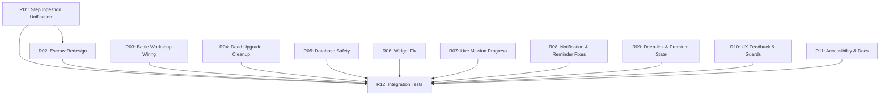

# Remediation Plan — Steps of Babylon

Bug and UX remediation based on the external code review (`docs/external-reviews/REPO_ANALYSIS_BUGS_AND_UX.md`). This plan runs in parallel with Plan 31 (Play Console) and must complete before production release.

Each sub-plan is a self-contained fix targeting one or more related findings from the review. Sub-plans are ordered by severity and dependency.

---

## Sub-Plan Index

| # | Sub-Plan | Description | Severity | Dependencies | Review Findings |
|---|---|---|---|---|---|
| R01 | Step Ingestion Unification | Eliminate double-crediting between StepCounterService and StepSyncWorker | Critical | — | Finding 1 |
| R02 | Escrow Redesign | Make Health Connect escrow a real pending-balance mechanism | Critical | R01 | Finding 2 |
| R03 | Battle Workshop Wiring | Pass real workshop utility levels into GameEngine | High | — | Finding 3 |
| R04 | Dead Upgrade Cleanup | Hide or implement STEP_MULTIPLIER and RECOVERY_PACKAGES | High | — | Finding 4 |
| R05 | Database Safety | Fix backup/restore crash + add Room migrations | High | — | Findings 5, 6 |
| R06 | Widget Fix | Fix balance display (always 0) and broken click target | High | — | Finding 7 |
| R07 | Live Mission Progress | Update walking missions from step pipeline, not screen open | High | — | Finding 8 |
| R08 | Notification & Reminder Fixes | Align persistent notification setting + update lastActiveAt | Medium | — | Findings 9, 10 |
| R09 | Deep-link & Premium State | Fix onNewIntent routing + centralize premium entitlements | Medium | — | Findings 11, 12 |
| R10 | UX Feedback & Guards | Action feedback, concurrent spend guards, midnight staleness | Medium | — | §4.3, §4.4 |
| R11 | Accessibility & Docs | Semantic labels, placeholder cleanup, README accuracy | Medium | — | §4.5, §4.6 |
| R12 | Integration Test Coverage | Service, notification, widget, deep-link, migration tests | High | R01–R11 | §4.7 |

---

## Dependency Graph

---

## Sub-Plan Details

### R01 — Step Ingestion Unification

**Severity:** Critical
**Files:** `service/StepCounterService.kt`, `service/StepSyncWorker.kt`, `data/sensor/DailyStepManager.kt`

**Problem:** StepCounterService and StepSyncWorker.sensorCatchUp() both credit the same sensor deltas into DailyStepManager independently. No shared baseline prevents double-counting.

**Tasks:**
1. Add a shared authoritative cumulative sensor baseline (persisted in SharedPreferences or Room) that both the service and worker read/write atomically.
2. Gate `sensorCatchUp()` in StepSyncWorker to only credit steps beyond the last baseline written by the service.
3. Add a "service alive" heartbeat check so the worker skips sensor catch-up when the foreground service is healthy.
4. Add unit tests: service-active scenario credits once, service-killed scenario worker recovers gap, concurrent scenario no double-credit.

**Acceptance criteria:**
- Walking with the foreground service active never produces duplicate step credits from the worker.
- Killing the service mid-walk allows the worker to recover only the uncredited gap.
- Existing 347 tests still pass.

---

### R02 — Escrow Redesign

**Severity:** Critical
**Files:** `data/healthconnect/StepCrossValidator.kt`, `data/repository/StepRepositoryImpl.kt`, `data/sensor/DailyStepManager.kt`, `data/local/DailyStepDao.kt`

**Problem:** Steps are credited to the player balance immediately. Escrow only writes metadata — it never withholds or reverses the balance. Reconciliation then adds escrow steps again, resulting in double-award.

**Tasks:**
1. When StepCrossValidator detects a discrepancy, subtract the excess from the player balance atomically (debit the over-credit).
2. Store the escrowed amount as a true pending balance in the daily step record.
3. On reconciliation (HC confirms steps): release escrow by adding the pending amount back to the player balance.
4. On discard (HC rejects steps): clear escrow without re-crediting — the debit already removed them.
5. Make escrow release/discard atomic with balance updates (single Room @Transaction).
6. Update StepCrossValidatorTest to assert actual player balance at every stage: pre-discrepancy, post-escrow, post-release, post-discard.

**Acceptance criteria:**
- Suspicious steps are deducted from the player balance when escrowed.
- Release adds them back exactly once. Discard leaves the deduction in place.
- No scenario produces a net double-credit or negative balance.

---

### R03 — Battle Workshop Wiring

**Severity:** High
**Files:** `presentation/battle/BattleScreen.kt`, `presentation/battle/BattleViewModel.kt`, `presentation/battle/GameSurfaceView.kt`, `presentation/battle/engine/GameEngine.kt`

**Problem:** BattleScreen passes `emptyMap()` for workshop levels when calling `surfaceView.configure(...)`. CASH_BONUS, CASH_PER_WAVE, and INTEREST upgrades have no effect in battle.

**Tasks:**
1. Expose the workshop level map from BattleViewModel (already has access to WorkshopRepository).
2. Pass the real map into `GameSurfaceView.configure()` and `playAgain()`.
3. Add a BattleViewModel test verifying the workshop map is non-empty when upgrades exist.

**Acceptance criteria:**
- GameEngine receives actual workshop levels for all utility upgrades.
- CASH_BONUS, CASH_PER_WAVE, and INTEREST produce measurable effects in battle.

---

### R04 — Dead Upgrade Cleanup

**Severity:** High
**Files:** `domain/model/UpgradeType.kt`, `presentation/workshop/WorkshopScreen.kt`

**Problem:** STEP_MULTIPLIER and RECOVERY_PACKAGES are purchasable but have no gameplay implementation.

**Tasks:**
1. Add a `hidden` or `implemented` flag to UpgradeType (or filter in WorkshopViewModel).
2. Exclude unimplemented upgrades from the workshop UI until their gameplay logic exists.
3. Update UpgradeTypeTest to verify hidden upgrades are excluded from the displayed list.

**Acceptance criteria:**
- Users cannot spend Steps on upgrades that have no effect.
- Upgrade enum entries remain in code for future implementation but are not purchasable.

---

### R05 — Database Safety

**Severity:** High
**Files:** `AndroidManifest.xml`, `data/local/DatabaseKeyManager.kt`, `di/DatabaseModule.kt`, `data/local/AppDatabase.kt`

**Problem:** (a) `allowBackup="true"` can restore encrypted DB + passphrase blob without the matching Keystore key, crashing on startup. (b) Schema is at version 7 with no migrations — any upgrade from an older schema crashes.

**Tasks:**
1. Add `android:dataExtractionRules` (API 31+) and `android:fullBackupContent` to exclude the database file and passphrase SharedPreferences from backup.
2. Add a try/catch in DatabaseKeyManager.getPassphrase() that detects decryption failure, wipes the stale blob, generates a fresh key, and logs a recovery event.
3. Add fallbackToDestructiveMigrationOnDowngrade (not destructive on upgrade) as a safety net for pre-release schema versions.
4. Document in CONSTRAINTS.md that post-release schema changes require explicit Migration objects.

**Acceptance criteria:**
- Backup/restore on a new device does not crash the app. User gets a fresh database with a clear-state experience.
- Upgrading from any pre-v7 dev/beta schema does not crash (destructive reset is acceptable pre-release).

---

### R06 — Widget Fix

**Severity:** High
**Files:** `data/sensor/DailyStepManager.kt`, `service/WidgetUpdateHelper.kt`, `service/StepWidgetProvider.kt`, `res/layout/widget_step_counter.xml`

**Problem:** (a) Widget balance is always passed as `0`. (b) Click PendingIntent targets `android.R.id.background` which doesn't exist in the widget layout.

**Tasks:**
1. In DailyStepManager.recordSteps(), fetch the real player Step balance and pass it to widgetUpdateHelper.update().
2. In StepWidgetProvider, bind the click PendingIntent to the actual root view ID from widget_step_counter.xml.
3. Verify the widget layout has a usable root ID; add one if needed.

**Acceptance criteria:**
- Widget displays the real Step balance after each step credit.
- Tapping the widget opens the app.

---

### R07 — Live Mission Progress

**Severity:** High
**Files:** `data/sensor/DailyStepManager.kt`, `presentation/missions/MissionsViewModel.kt`, `data/local/DailyMissionDao.kt`

**Problem:** Walking mission progress only updates when MissionsViewModel.init runs (user opens Missions screen).

**Tasks:**
1. After crediting steps in DailyStepManager, update walking mission progress in the daily_missions table (increment progress for today's WALKING missions based on new daily total).
2. Remove or keep the MissionsViewModel.init refresh as a fallback, but it should no longer be the only update path.
3. Add a test: credit steps → verify walking mission progress incremented without opening Missions screen.

**Acceptance criteria:**
- Walking missions reflect real-time step progress without requiring the user to visit the Missions screen.
- Home screen badges and mission claimability are current.

---

### R08 — Notification & Reminder Fixes

**Severity:** Medium
**Files:** `service/StepCounterService.kt`, `service/StepNotificationManager.kt`, `presentation/settings/NotificationSettingsScreen.kt`, `service/SmartReminderManager.kt`, `data/repository/PlayerRepositoryImpl.kt`

**Problem:** (a) Persistent notification setting doesn't actually control the foreground notification. (b) SmartReminderManager checks lastActiveAt but nothing ever updates it.

**Tasks:**
1. Rename the "Step Counter" notification toggle to accurately describe what it controls (e.g., "Step count updates in notification") or make the service use a minimal silent notification when the preference is off.
2. Update lastActiveAt in PlayerRepositoryImpl when the app comes to foreground (call from MainActivity.onResume or equivalent).
3. Add a test for SmartReminderManager that verifies reminders are suppressed when lastActiveAt is recent.

**Acceptance criteria:**
- The notification setting label matches its runtime behavior.
- Smart reminders respect actual user activity, not a stale timestamp.

---

### R09 — Deep-link & Premium State

**Severity:** Medium
**Files:** `presentation/MainActivity.kt`, `presentation/store/StoreViewModel.kt`, `presentation/battle/BattleViewModel.kt`, `data/billing/StubBillingManager.kt`

**Problem:** (a) Supply notification deep-links fail when the app is already open (no onNewIntent handling). (b) Season pass expiry is checked inconsistently across screens. (c) adRemoved flag is lost on battle replay.

**Tasks:**
1. Override onNewIntent() in MainActivity and route `navigate_to` extras into the NavController.
2. Create a shared premium entitlement resolver (domain or data layer) that checks seasonPassActive + expiry in one place. Use it from StoreViewModel, HomeViewModel, and BattleViewModel.
3. Preserve adRemoved when BattleViewModel.playAgain() resets BattleUiState.

**Acceptance criteria:**
- Tapping a supply notification while the app is open navigates to Supplies.
- Season pass state is consistent across all screens.
- Ad-free state persists across battle replays.

---

### R10 — UX Feedback & Guards

**Severity:** Medium
**Files:** Multiple ViewModels (Store, Cards, Labs, Workshop, Battle), `data/local/PlayerProfileDao.kt`

**Problem:** (a) Action failures are silent — no snackbar/toast for insufficient currency, maxed upgrades, etc. (b) No in-progress guards on purchase/ad buttons — double-taps can fire overlapping coroutines. (c) Date-sensitive ViewModels capture LocalDate.now() once and go stale across midnight.

**Tasks:**
1. Add a `userMessage: String?` or sealed event to relevant UiState classes. Surface use-case result failures as transient messages.
2. Use the existing `isPurchasing` flag in StoreUiState (currently unused) to disable buttons during async work. Add equivalent guards to Cards, Labs, and Workshop.
3. Add DAO-level non-negative guards on currency decrement queries (`SET steps = MAX(0, steps - :amount)` or transactional check-then-deduct).
4. In long-lived ViewModels (Home, Missions, Stats), observe a midnight tick or recompute date on resume.

**Acceptance criteria:**
- Users see feedback when an action fails (insufficient funds, already maxed, etc.).
- Rapid tapping cannot trigger duplicate purchases.
- Screens refresh correctly across midnight without requiring app restart.

---

### R11 — Accessibility & Docs

**Severity:** Medium
**Files:** `presentation/battle/BattleScreen.kt`, `presentation/battle/ui/PostRoundOverlay.kt`, `presentation/home/HomeScreen.kt`, `HealthConnectPermissionActivity.kt`, `docs/release/privacy-policy.md`, `docs/release/play-store-listing.md`, `README.md`

**Problem:** (a) Battle controls use symbol-only labels (▶, ⏸, ⚡) without content descriptions. (b) Privacy policy and store listing contain `<contact-email>` placeholders. (c) README references instrumented tests and run-gradle.sh that don't exist.

**Tasks:**
1. Add `contentDescription` / `semantics` to all icon-only and symbol-only buttons in battle UI, home screen, and overlays.
2. Replace all `<contact-email>` placeholders with the real contact address.
3. Remove instrumented test references from README or add a note that they are deferred. Either ship run-gradle.sh or remove the recommendation.

**Acceptance criteria:**
- TalkBack can announce all interactive controls meaningfully.
- No placeholder text remains in user-facing or compliance-facing documents.
- README accurately reflects the repo's current state.

---

### R12 — Integration Test Coverage

**Severity:** High
**Files:** `app/src/test/`, `app/src/androidTest/` (new)

**Problem:** Services, notifications, widget, deep-links, and Room migrations have no test coverage. These are the most failure-prone lifecycle-driven components.

**Tasks:**
1. Add Robolectric or instrumented tests for StepCounterService startup and step crediting.
2. Add tests for StepSyncWorker: service-alive skip, gap recovery, no double-credit (may overlap with R01 tests).
3. Add Room MigrationTestHelper tests for schema version transitions.
4. Add tests for widget update (correct balance, correct click target).
5. Add tests for deep-link intent routing (cold start + onNewIntent).
6. Add end-to-end escrow balance tests (pre-discrepancy → escrow → release/discard → final balance).

**Acceptance criteria:**
- All new remediation code has test coverage.
- Migration tests cover every schema version transition.
- CI test suite remains green.

---

## Execution Notes

- **Critical path:** R01 → R02 → R12. These must be sequential.
- **Parallelizable:** R03, R04, R05, R06, R07, R08, R09, R10, R11 are all independent of each other and can run in parallel.
- **Blocking release:** R01, R02, R03, R04, R05 must complete before any production release (Plan 31).
- **Pre-release recommended:** R06, R07, R08, R09 should complete before production but are not data-integrity risks.
- **Post-release acceptable:** R10, R11, R12 improve quality but do not risk data corruption or progression integrity.

---

## Priority Tiers

**Tier 1 — Must fix before release (data integrity):**
- R01: Step Ingestion Unification
- R02: Escrow Redesign
- R03: Battle Workshop Wiring
- R04: Dead Upgrade Cleanup
- R05: Database Safety

**Tier 2 — Should fix before release (user trust):**
- R06: Widget Fix
- R07: Live Mission Progress
- R08: Notification & Reminder Fixes
- R09: Deep-link & Premium State

**Tier 3 — Fix before or shortly after release (polish):**
- R10: UX Feedback & Guards
- R11: Accessibility & Docs
- R12: Integration Test Coverage

---

## Status

- [x] R01: Step Ingestion Unification
- [ ] R02: Escrow Redesign
- [ ] R03: Battle Workshop Wiring
- [ ] R04: Dead Upgrade Cleanup
- [ ] R05: Database Safety
- [ ] R06: Widget Fix
- [ ] R07: Live Mission Progress
- [ ] R08: Notification & Reminder Fixes
- [ ] R09: Deep-link & Premium State
- [ ] R10: UX Feedback & Guards
- [ ] R11: Accessibility & Docs
- [ ] R12: Integration Test Coverage
