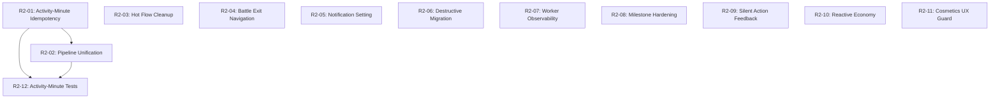

# Remediation Plan R2 — Steps of Babylon

Bug and UX remediation based on the second external code review (`docs/external-reviews/REPO_ANALYSIS_BUGS_AND_UX_2.md`). This plan addresses findings not covered by Plan R (first remediation). Must complete before production release.

---

## Sub-Plan Index

| # | Sub-Plan | Description | Severity | Dependencies | Review Findings |
|---|---|---|---|---|---|
| R2-01 | Activity-Minute Idempotency | Make exercise-session import delta-based to prevent double-crediting | Critical | — | Finding 1 |
| R2-02 | Activity-Minute Pipeline Unification | Route activity-minute credits through canonical progression pipeline | High | R2-01 | Finding 2 |
| R2-03 | Hot Flow Cleanup | Replace `stateIn(viewModelScope).value` with `first()` in action handlers | High | — | Finding 3 |
| R2-04 | Battle Exit Navigation | Fix "Return to Workshop" label/behavior mismatch | High | — | Finding 4 |
| R2-05 | Notification Setting Alignment | Fix "Step Count Updates" toggle wording to match foreground service reality | High | — | Finding 5 |
| R2-06 | Destructive Migration Removal | Replace `.fallbackToDestructiveMigration()` with explicit migrations | High | — | Finding 6 |
| R2-07 | Worker Error Observability | Add structured logging to StepSyncWorker HC catch block | High | — | §4.2 |
| R2-08 | Milestone Domain Hardening | Add step-threshold validation to ClaimMilestone + dedup notifications | Medium | — | Findings 7, 8; §4.1 |
| R2-09 | Silent Action Feedback | Add user messages to freeRush and other silent-return paths | Medium | — | §4.4 |
| R2-10 | Reactive Economy Dashboard | Convert CurrencyDashboardViewModel from snapshot to live combined flow | Medium | — | §4.1 |
| R2-11 | Cosmetics UX Guard | Gate cosmetic purchase/equip until visual application exists | Medium | — | §4.3, §4.4 |
| R2-12 | Activity-Minute Test Coverage | Tests for idempotency, pipeline unification, and ceiling behavior | High | R2-01, R2-02 | §4.7 |

---

## Dependency Graph

---

## Sub-Plan Details

### R2-01 — Activity-Minute Idempotency

**Severity:** Critical
**Files:** `data/sensor/DailyStepManager.kt`, `data/repository/StepRepositoryImpl.kt`, `data/local/DailyStepRecordEntity.kt`, `data/local/DailyStepDao.kt`, `service/StepSyncWorker.kt`

**Problem:** `recordActivityMinutes()` re-initializes `dailyCreditedTotal` from `existing.creditedSteps` (sensor-only field) when the process restarts. Since activity-minute credits are added via `playerRepository.addSteps()` but never reflected in `creditedSteps`, repeated worker runs re-credit the same exercise sessions. `updateActivityMinutes()` overwrites `stepEquivalents` idempotently in Room, but the balance addition is cumulative.

**Tasks:**
1. In `recordActivityMinutes()`, read the previously stored `stepEquivalents` from the daily record before crediting.
2. Compute the delta: `newCredits = stepEquivalents - previouslyStoredStepEquivalents`. Only call `playerRepository.addSteps(delta)` for the positive delta.
3. Update `dailyCreditedTotal` to include the stored `stepEquivalents` during initialization (not just `creditedSteps`).
4. Ensure `updateActivityMinutes()` stores the cumulative `stepEquivalents` so subsequent runs compute correct deltas.

**Acceptance criteria:**
- Running the worker twice with identical HC sessions produces zero additional balance credits on the second run.
- Running the worker after new sessions appear credits only the incremental step-equivalents.
- Daily ceiling applies to the combined total of sensor steps + activity-minute step-equivalents.

---

### R2-02 — Activity-Minute Pipeline Unification

**Severity:** High
**Files:** `data/sensor/DailyStepManager.kt`

**Problem:** `recordActivityMinutes()` only calls `stepRepository.updateActivityMinutes()` and `playerRepository.addSteps()`. It skips widget updates, supply drop generation, economy rewards (daily login, weekly challenge), and walking mission progress that `recordSteps()` performs.

**Tasks:**
1. After crediting activity-minute steps in `recordActivityMinutes()`, call the same follow-on pipeline as `recordSteps()`:
   - Widget update (`widgetUpdateHelper.update()`)
   - Supply drop generation (`generateSupplyDrop()`)
   - Economy rewards (`trackDailyLogin.checkAndAward()`, `trackWeeklyChallenge.checkAndAward()`)
   - Walking mission progress (`updateWalkingMissions()`)
2. Wrap each follow-on in try/catch (best-effort), matching the pattern in `recordSteps()`.

**Acceptance criteria:**
- Activity-minute credits trigger the same widget, mission, supply drop, and economy updates as sensor steps.
- No regression in sensor-step crediting behavior.

---

### R2-03 — Hot Flow Cleanup

**Severity:** High
**Files:** `presentation/workshop/WorkshopViewModel.kt`, `presentation/cards/CardsViewModel.kt`, `presentation/labs/LabsViewModel.kt`, `presentation/store/StoreViewModel.kt`

**Problem:** 12 occurrences of `observeX().stateIn(viewModelScope).value` inside click/action handlers. Each call creates a new hot `StateFlow` tied to the ViewModel scope that is never cancelled. Repeated user interactions accumulate unnecessary collectors and risk stale reads.

**Tasks:**
1. Replace all `observeX().stateIn(viewModelScope).value` calls with `observeX().first()` (suspending one-shot read).
2. Where the value is already available in the existing `_uiState`, read from `_uiState.value` instead.
3. Verify all affected action methods are already inside `viewModelScope.launch` (they are — `first()` is safe here).

**Files and occurrences:**
- `WorkshopViewModel.kt`: 2 occurrences (lines 83, 110)
- `CardsViewModel.kt`: 3 occurrences (lines 81, 104, 137)
- `LabsViewModel.kt`: 5 occurrences (lines 107, 129, 130, 146, 149)
- `StoreViewModel.kt`: 1 occurrence (line 78)

**Acceptance criteria:**
- Zero occurrences of `stateIn(viewModelScope).value` in action handlers.
- All existing ViewModel tests still pass.

---

### R2-04 — Battle Exit Navigation

**Severity:** High
**Files:** `presentation/battle/ui/PostRoundOverlay.kt`

**Problem:** Button text says "Return to Workshop" but `MainActivity` wires battle exit to `navController.popBackStack()`, which returns to whatever screen preceded battle — not necessarily Workshop.

**Tasks:**
1. Rename the button text from "Return to Workshop" to "Leave Battle" (accurate for any entry point).

**Acceptance criteria:**
- Button text accurately describes the navigation behavior regardless of how battle was entered.

---

### R2-05 — Notification Setting Alignment

**Severity:** High
**Files:** `presentation/settings/NotificationSettingsScreen.kt`

**Problem:** Toggle labeled "Step Count Updates" with description "Show step count and balance in the notification" implies the user can hide the foreground notification entirely. Android requires a visible notification for foreground services.

**Tasks:**
1. Change the toggle description to: "Update notification with live step count and balance. A minimal tracking notification is always shown while step counting is active."
2. This accurately describes the behavior: the toggle controls content richness, not notification existence.

**Acceptance criteria:**
- Setting description clearly communicates that a notification will always be present.
- No code changes needed in the service — only the label/description text.

---

### R2-06 — Destructive Migration Removal

**Severity:** High
**Files:** `di/DatabaseModule.kt`

**Problem:** `.fallbackToDestructiveMigration()` will silently wipe all user data on any schema version bump in production. This is acceptable during development but catastrophic post-release.

**Tasks:**
1. Replace `.fallbackToDestructiveMigration()` with `.fallbackToDestructiveMigrationOnDowngrade()`.
2. This preserves the safety net for downgrades (dev/QA) while requiring explicit `Migration` objects for any schema version increase.
3. Update the comment to reflect the change.

**Acceptance criteria:**
- Schema version increases without a matching Migration will crash (fail-fast) rather than silently wipe data.
- Schema downgrades (dev/QA only) still reset gracefully.

---

### R2-07 — Worker Error Observability

**Severity:** High
**Files:** `service/StepSyncWorker.kt`

**Problem:** The Health Connect catch block (`catch (_: Exception) {}`) silently swallows all errors. When exercise credits don't appear, there is no diagnostic trail.

**Tasks:**
1. Replace the empty catch with `catch (e: Exception) { android.util.Log.w("StepSyncWorker", "HC sync failed", e) }`.
2. Apply the same pattern to the smart reminder catch block.

**Acceptance criteria:**
- HC failures appear in logcat with tag `StepSyncWorker`.
- Worker still returns `Result.success()` (best-effort behavior preserved).

---

### R2-08 — Milestone Domain Hardening

**Severity:** Medium
**Files:** `domain/usecase/ClaimMilestone.kt`, `presentation/home/HomeViewModel.kt`

**Problem:** (a) `ClaimMilestone` only checks `claimed == true` but not whether the player has actually reached `milestone.requiredSteps`. (b) `HomeViewModel.init` notifies the first achievable unclaimed milestone on every app entry with no dedup.

**Tasks:**
1. In `ClaimMilestone`, add a step-threshold check: read `playerRepository.observeProfile().first().totalStepsEarned` and return `false` if below `milestone.requiredSteps`.
2. In `HomeViewModel`, persist a "last notified milestone" in `MilestoneDao` or a SharedPreferences key. Only fire the notification if the milestone hasn't been notified before.

**Acceptance criteria:**
- Calling `ClaimMilestone` for a milestone the player hasn't reached returns `false` and awards nothing.
- Milestone achievement notification fires at most once per milestone.

---

### R2-09 — Silent Action Feedback

**Severity:** Medium
**Files:** `presentation/labs/LabsViewModel.kt`

**Problem:** `freeRush()` has 3 early-return branches (season pass inactive, already used today, no matching research) that return without setting `_userMessage`. Users see no feedback.

**Tasks:**
1. Add `_userMessage.value = "..."` before each early return in `freeRush()`:
   - Season pass inactive/expired → "Season Pass required"
   - Already used today → "Free rush already used today"
   - No matching active research → "No active research to rush"

**Acceptance criteria:**
- Every blocked `freeRush()` path produces a visible user message.

---

### R2-10 — Reactive Economy Dashboard

**Severity:** Medium
**Files:** `presentation/economy/CurrencyDashboardViewModel.kt`

**Problem:** `loadState()` runs once in `init` using `first()`. The screen becomes stale if the user earns steps, claims rewards, or crosses midnight while viewing it.

**Tasks:**
1. Replace the one-shot `loadState()` with a `combine()` of `playerRepository.observeProfile()` and a periodic/event-driven refresh for weekly/login data.
2. At minimum, re-trigger `loadState()` when the screen resumes (add a `refresh()` method called from the screen's `LaunchedEffect`).

**Acceptance criteria:**
- Currency balances update in real-time while the Economy screen is visible.
- Weekly progress and streak data refresh on screen entry.

---

### R2-11 — Cosmetics UX Guard

**Severity:** Medium
**Files:** `presentation/store/StoreScreen.kt`

**Problem:** The cosmetics section shows "Visual application coming soon" but still renders active Buy/Equip buttons. Users can spend premium currency on items with no visible effect.

**Tasks:**
1. Disable the Buy button for unowned cosmetics: replace with a disabled button showing "Coming Soon".
2. Keep Equip/Unequip functional for already-owned cosmetics (they're stored in the DB and will work when visuals are implemented).
3. Remove or rephrase the "Visual application coming soon" text to "Cosmetic visuals are being finalized. Purchases are disabled until ready."

**Acceptance criteria:**
- Users cannot spend currency on cosmetics that have no visible effect.
- Already-owned cosmetics can still be equipped/unequipped for future use.

---

### R2-12 — Activity-Minute Test Coverage

**Severity:** High
**Files:** `app/src/test/java/com/whitefang/stepsofbabylon/data/sensor/DailyStepManagerTest.kt`

**Problem:** No tests exist for `recordActivityMinutes()`. This is the highest-risk crediting path and the one most likely to double-credit.

**Tasks:**
1. Add test: single worker run credits correct step-equivalents.
2. Add test: two consecutive worker runs with identical sessions produce zero additional credits on the second run (idempotency).
3. Add test: worker run after new sessions appear credits only the incremental delta.
4. Add test: activity-minute credits respect the 50k daily ceiling in combination with sensor steps.
5. Add test: activity-minute credits trigger walking mission progress updates (after R2-02).
6. Add test: activity-minute credits trigger widget updates (after R2-02).

**Acceptance criteria:**
- All 6 tests pass.
- Existing test suite remains green.

---

## Execution Notes

- **Critical path:** R2-01 → R2-02 → R2-12. These must be sequential.
- **Parallelizable:** R2-03, R2-04, R2-05, R2-06, R2-07, R2-08, R2-09, R2-10, R2-11 are all independent and can run in parallel.
- **Blocking release:** R2-01, R2-02, R2-06 must complete before production release (data integrity).
- **Pre-release recommended:** R2-03, R2-04, R2-05, R2-07, R2-12 should complete before production.
- **Post-release acceptable:** R2-08, R2-09, R2-10, R2-11 improve quality but are not data-integrity risks.

---

## Priority Tiers

**Tier 1 — Must fix before release (data integrity):**
- R2-01: Activity-Minute Idempotency
- R2-02: Activity-Minute Pipeline Unification
- R2-06: Destructive Migration Removal

**Tier 2 — Should fix before release (user trust / code quality):**
- R2-03: Hot Flow Cleanup
- R2-04: Battle Exit Navigation
- R2-05: Notification Setting Alignment
- R2-07: Worker Error Observability
- R2-12: Activity-Minute Test Coverage

**Tier 3 — Fix before or shortly after release (polish):**
- R2-08: Milestone Domain Hardening
- R2-09: Silent Action Feedback
- R2-10: Reactive Economy Dashboard
- R2-11: Cosmetics UX Guard

---

## Relationship to Plan R (First Remediation)

Plan R addressed 12 findings from the first external review. This plan (R2) addresses findings from the second review that were either:
- **Not covered by Plan R** (activity-minute idempotency, hot flow pattern, cosmetics UX, economy dashboard reactivity)
- **Partially addressed but not fully resolved** (notification setting wording, destructive migration, silent action feedback, milestone validation)

The two plans are complementary. Plan R focused on sensor-step double-crediting, escrow mechanics, battle wiring, and widget fixes. Plan R2 focuses on the activity-minute crediting path, ViewModel state management patterns, and remaining UX trust issues.

---

## Status

- [x] R2-01: Activity-Minute Idempotency
- [x] R2-02: Activity-Minute Pipeline Unification
- [x] R2-03: Hot Flow Cleanup
- [ ] R2-04: Battle Exit Navigation
- [ ] R2-05: Notification Setting Alignment
- [ ] R2-06: Destructive Migration Removal
- [ ] R2-07: Worker Error Observability
- [ ] R2-08: Milestone Domain Hardening
- [ ] R2-09: Silent Action Feedback
- [ ] R2-10: Reactive Economy Dashboard
- [ ] R2-11: Cosmetics UX Guard
- [ ] R2-12: Activity-Minute Test Coverage
