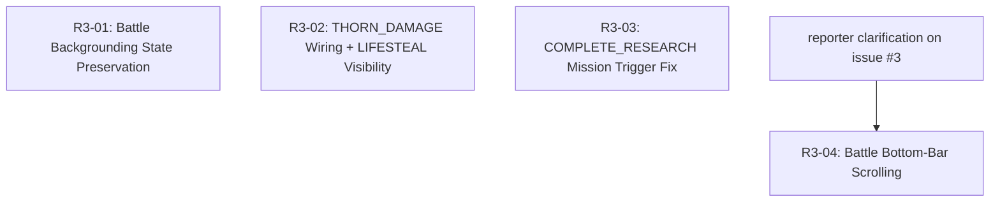

# Remediation Plan R3 — Steps of Babylon

Bug remediation based on the v5 internal-track on-device smoke test on 2026-05-19 plus user-driven exploratory testing. Source of record is the GitHub issue tracker on `JonWhiteFang/steps-of-babylon` — every sub-plan below maps 1:1 to a numbered issue, and every fix PR closes its issue via the `Fixes #N` keyword.

This plan runs immediately after Plan RO-12 (in-round stat drift) and gates the closed-track promotion: every R3 issue must be either Closed or moved out of the `v1.0.0 closed-test gate` milestone before the internal v6 build is promoted to closed testing.

Each sub-plan is a self-contained fix targeting one issue. Sub-plans are ordered by GitHub-issue severity label (`severity:blocker` → `severity:major` → `severity:minor`), not by issue number — that way the execution order reflects the closed-test risk, and R3-01 is always the next thing to ship.

---

## Sub-Plan Index

| # | Sub-Plan | Description | Severity | Dependencies | GitHub Issue |
|---|---|---|---|---|---|
| R3-01 | Battle Backgrounding State Preservation | Mid-round backgrounding must not reset wave/cash/kills; speed/pause UI must stay in sync with the game thread on resume | Blocker | — | [#2](https://github.com/JonWhiteFang/steps-of-babylon/issues/2) |
| R3-02 | THORN_DAMAGE Wiring + LIFESTEAL Visibility | THORN_DAMAGE upgrade does not reflect any damage to attackers; LIFESTEAL works mathematically but produces no visible heal at low levels | Major | — | [#4](https://github.com/JonWhiteFang/steps-of-babylon/issues/4) |
| R3-03 | COMPLETE_RESEARCH Mission Trigger Fix | Daily mission ticks "research complete" the moment the Labs screen is opened, regardless of whether anything actually completed | Major | — | [#1](https://github.com/JonWhiteFang/steps-of-babylon/issues/1) |
| R3-04 | Battle Bottom-Bar Scrolling | Bottom bar reportedly cannot be scrolled during a round — exact surface (in-round upgrade menu vs. UW bar vs. Overdrive menu) unconfirmed | Minor | Reporter clarification | [#3](https://github.com/JonWhiteFang/steps-of-babylon/issues/3) |

---

## Dependency Graph

R3-01 / R3-02 / R3-03 are independent and can be worked on in any order; the recommended sequence is severity-first. R3-04 is blocked until the reporter responds (or 7 days elapse and we close the issue per the `needs-more-info` policy).

---

## Sub-Plan Details

### R3-01 — Battle Backgrounding State Preservation

**Severity:** Blocker
**GitHub Issue:** [#2](https://github.com/JonWhiteFang/steps-of-babylon/issues/2)
**Files (suspected):** `presentation/battle/BattleViewModel.kt`, `presentation/battle/GameSurfaceView.kt`, `presentation/battle/GameLoopThread.kt`, `presentation/battle/engine/GameEngine.kt`, `presentation/battle/BattleScreen.kt`

**Problem:** When the user backgrounds the app mid-round (Recents button, app switcher, screen lock, incoming notification full-screen) and returns, the round is reset: wave counter back to 1 (or `startWave` from WAVE_SKIP), cash to zero, kill count to zero. Additionally the speed/pause UI controls become desynced from the actual game thread — speed shows 1× while the loop is still ticking at 2×, or pause icon shows "paused" while the game continues.

**Suspected root cause (must confirm before fixing):**
1. `SurfaceView.SurfaceHolder` calls `surfaceDestroyed` on backgrounding which currently kills the `GameLoopThread`. On `surfaceCreated` after resume, `engine.init(...)` is called fresh — wiping wave/cash/kills.
2. Speed and pause state live in two places: `BattleUiState` (for the Compose overlay) and the `GameLoopThread` / `GameEngine` (for the loop itself). The two diverge when the thread is recreated.
3. Note that `BattleViewModel.onCleared` already routes mid-round persistence through `@ApplicationScope CoroutineScope` (RO-03 / B.3 PR 2). That handles persistence-on-process-death. It does **not** handle resume-while-VM-still-alive, which is the scenario here.

**Tasks:**
1. **Reproduce + write the failing test first.** Add a `BattleViewModelTest` entry that:
   - starts a round, advances to wave 3, accumulates some cash + kills,
   - simulates `surfaceDestroyed` followed by `surfaceCreated` (or whatever the equivalent test seam is — may require extracting one),
   - asserts wave / cash / kills survive the cycle.
   - This test must fail on `main` before any fix lands.
2. **Pick one of three remediation strategies.** Confirm the choice in this plan before writing code:
   - (a) Lift `GameEngine` ownership out of the surface-lifecycle path. The engine lives on the ViewModel; the SurfaceView only attaches/detaches a renderer + input listener. (Cleanest, biggest diff.)
   - (b) Snapshot engine state to `BattleUiState` on pause; restore on resume. (Smallest diff, brittle if any field is missed.)
   - (c) Persist engine state to `RoundState` in Room on pause; reload on resume. (Heaviest, but durable across process death too — closes a separate latent gap.)
3. **Audit the speed/pause sources of truth.** Make `BattleUiState.speedMultiplier` and `BattleUiState.isPaused` the single source of truth; `GameLoopThread` reads from there each frame. Remove any duplicated state.
4. **Add a second regression test** specifically asserting that after pause/resume, `BattleUiState.speedMultiplier` and `BattleUiState.isPaused` match the actual loop-thread behaviour.

**Acceptance criteria:**
- Backgrounding and resuming mid-round preserves: current wave, in-round cash, kill count, in-round upgrade levels, ziggurat HP, equipped UW cooldowns, active overdrive timer.
- Speed control reflects actual loop speed multiplier at all times.
- Pause toggle reflects actual pause state at all times.
- All existing 615 JVM tests still pass; ≥2 new tests added (state preservation + UI/loop sync).

---

### R3-02 — THORN_DAMAGE Wiring + LIFESTEAL Visibility

**Severity:** Major
**GitHub Issue:** [#4](https://github.com/JonWhiteFang/steps-of-babylon/issues/4)
**Files (suspected):** `presentation/battle/engine/CollisionSystem.kt`, `presentation/battle/entities/EnemyEntity.kt`, `presentation/battle/entities/ZigguratEntity.kt`, `presentation/battle/engine/GameEngine.kt`, `domain/usecase/CalculateDamage.kt`, `domain/usecase/ResolveStats.kt`, `domain/usecase/ApplyCardEffects.kt`

**Problem A — THORN_DAMAGE never reflects.** The THORN_DAMAGE Workshop upgrade is purchasable, has a level-scaled `effectPerLevel` in `UpgradeConfig`, and produces a non-zero `thornDamage` value in `ResolvedStats`. But on the melee-hit code path where an `EnemyEntity` deals damage to the ziggurat, no reflective damage is ever applied back to the enemy. Same shape as the RO-08 STEP_MULTIPLIER, RO-09 #1 CHRONO_FIELD, RO-11 dead-`ResearchType` gaps: stat declared, computed, plumbed, but never read by any consumer.

**Problem B — LIFESTEAL imperceptible at low levels.** LIFESTEAL is wired correctly per Plan 10 / `CalculateDamage` (heal = `damageDealt × stats.lifestealPercent`, capped at 15 %). At level 1 the percent is small enough that a per-shot heal rounds to zero or to a sub-pixel HP bar movement that is invisible in practice. This is *probably* a balance tuning issue, not a wiring bug — but it must be confirmed and either tuned or documented as expected.

**Tasks:**
1. **Confirm the THORN_DAMAGE dead-stat hypothesis** with a focused search:
   - `grep -r "thornDamage" app/src/main` → expect to find it set in `ResolveStats` and exposed via `ResolvedStats`, but nowhere read in any `presentation/battle/` consumer.
   - If confirmed: same fix shape as RO-09 #1 — find the ziggurat-takes-damage site and apply `enemy.hp -= incomingDamage * stats.thornDamage` (or whatever the GDD-correct formula is — check `docs/battle-formulas.md`).
2. **Add a failing GameEngineTest for THORN_DAMAGE before fixing.** Spawn a known enemy at melee range with known HP, run the engine for one melee tick with `stats.thornDamage = 0.5`, assert enemy HP decreased by `0.5 × meleeDamage`. Test must fail on `main`.
3. **Investigate LIFESTEAL.** Add a focused unit test that exercises `CalculateDamage` with `stats.lifestealPercent` at 0.01 / 0.05 / 0.10 / 0.15 and asserts the heal is non-zero and surfaced into the `DamageResult`. If math is correct, this is a balance issue:
   - Option (a): bump LIFESTEAL `effectPerLevel` until level 1 produces a visible heal (≥1 HP per kill at base ziggurat HP).
   - Option (b): change the heal application to accumulate fractional heal and apply when ≥1 HP, so even small percentages produce visible bursts.
   - Option (c): document as expected — LIFESTEAL is meant to be useful only at higher levels — and add an in-game tooltip.
   - Pick one in this plan before writing code.
4. **Add regression tests for both fixes.** Aim for ≥3 net new tests (THORN apply, THORN scales linearly, LIFESTEAL produces non-zero observable heal).

**Acceptance criteria:**
- THORN_DAMAGE Lv 1+ visibly reflects damage on melee enemy hits — verifiable on device by buying THORN_DAMAGE then letting a Tank enemy melee the ziggurat.
- LIFESTEAL produces a visible HP recovery within 5 kills at Lv 1+ (whichever resolution path is chosen).
- All existing tests pass; new regression tests guard both behaviours against future RO-08-shape regressions.

---

### R3-03 — COMPLETE_RESEARCH Mission Trigger Fix

**Severity:** Major
**GitHub Issue:** [#1](https://github.com/JonWhiteFang/steps-of-babylon/issues/1)
**Files (suspected):** `presentation/labs/LabsViewModel.kt`, `domain/usecase/CheckResearchCompletion.kt`, `domain/usecase/CompleteResearch.kt`, `domain/usecase/RushResearch.kt`, `presentation/missions/MissionsViewModel.kt` (or wherever `MissionCategory.UPGRADE` progress is incremented for COMPLETE_RESEARCH).

**Problem:** Opening the Labs screen advances the daily COMPLETE_RESEARCH mission counter even when no research finished. The most likely cause is that `LabsViewModel.init` runs `CheckResearchCompletion` (per its design — auto-complete expired research on app launch / Labs entry) and the daily-mission-progress hook fires even when the use case's return value indicates "nothing was actually completed." This double-faults: the use case probably returns the right value, but the call site treats every invocation as a completion event.

Note that `CheckResearchCompletion` was added precisely to handle the auto-complete-on-launch path — so the fix must keep that working. The bug is in *what counts as a mission tick*, not in *whether the use case runs*.

**Tasks:**
1. **Reproduce.** Manual: start a fresh round, open Labs with no in-flight research → daily missions screen shows COMPLETE_RESEARCH at 1/1. (Already reported on device.)
2. **Trace the increment.** Find where `DailyMissionType.COMPLETE_RESEARCH` progress is updated. Likely in either `LabsViewModel`, `CheckResearchCompletion`, or a daily-mission listener wired to one of them.
3. **Write the failing test first.** A `LabsViewModelTest` (or `CheckResearchCompletionTest` extension) that initialises Labs with zero in-flight research and asserts the COMPLETE_RESEARCH mission counter does not move. Must fail on `main`.
4. **Fix.** Tighten the increment to only fire when `CheckResearchCompletion` actually completes ≥1 research, when `CompleteResearch` runs successfully, or when `RushResearch` runs successfully. Open Labs with nothing happening → no mission tick.
5. **Add the inverse regression test.** Start research, fast-forward time so it expires, open Labs → COMPLETE_RESEARCH ticks by exactly 1.

**Acceptance criteria:**
- Opening Labs with no completed research does not advance COMPLETE_RESEARCH.
- Auto-completion of expired research on app launch / Labs open does advance COMPLETE_RESEARCH by exactly the number of completed projects.
- Manual `CompleteResearch` and `RushResearch` paths still tick the mission.
- ≥2 new regression tests (positive + negative).

---

### R3-04 — Battle Bottom-Bar Scrolling

**Severity:** Minor (provisional pending reporter response)
**GitHub Issue:** [#3](https://github.com/JonWhiteFang/steps-of-babylon/issues/3) — currently labeled `needs-more-info`
**Files (TBD):** Depends on which surface the reporter meant — `presentation/battle/ui/InRoundUpgradeMenu.kt`, `presentation/battle/ui/UltimateWeaponBar.kt`, or `presentation/battle/ui/OverdriveMenu.kt`.

**Problem:** Reporter says "bottom bar can't scroll during a round." Three candidate surfaces during a round have a horizontally or vertically scrollable bottom area:
1. The in-round upgrade menu's three category tabs (Attack / Defense / Utility) and the `LazyColumn` of upgrade rows within each tab.
2. The Ultimate Weapon bar at the bottom of the screen (when ≥1 UW is equipped).
3. The Overdrive menu (when triggered).

Without a reproduction on a known device + a clear description of which surface, fix attempts will be guesswork.

**Tasks:**
1. **Wait for reporter response.** A `needs-more-info` comment was posted on issue #3 asking for: which bottom bar, device + Android version, exact failure mode, screen recording. Per the project triage policy (industry standard 7-day window), if no reply by 2026-05-26 the issue closes automatically and we revisit only if the reporter follows up.
2. **If reply received:** scope a focused sub-plan body in this file under R3-04 with the exact surface, repro steps, and fix. If the bug is a Compose nested-scroll conflict it is most likely a `Modifier.nestedScroll` or a `LazyColumn` inside a `Column` with `scrollable` issue and the fix is small.
3. **If no reply by 2026-05-26:** close the issue with the canned `needs-more-info-stale` message and remove R3-04 from the milestone.

**Acceptance criteria:** TBD based on reporter response.

---

## Execution Notes

- **Critical path:** R3-01 → R3-02 → R3-03. All three must be Closed before the internal v6 build can be promoted to closed testing.
- **Parallelizable:** R3-02 and R3-03 are independent and can be worked simultaneously by different sessions if desired. R3-01 is the highest-risk diff and warrants doing alone first.
- **Blocking closed-track promotion:** R3-01, R3-02, R3-03.
- **Blocked-on-info:** R3-04 — does not block promotion if it stays in `needs-more-info` past the 7-day window.
- **Per-fix protocol** (matches the project's existing R / R2 / RO-08 / RO-09 / RO-11 / RO-12 cadence):
  1. Branch named `fix/<issue-number>-short-slug`.
  2. Failing regression test committed first (red).
  3. Fix lands; tests go green; full suite stays green.
  4. Doc-sync per `.kiro/steering/11-agent-protocol.md` PR Task-List Convention (AGENTS.md test count, CHANGELOG.md, source-files.md, structure.md if applicable, STATE.md, RUN_LOG.md).
  5. PR title `fix(<area>): 
 (#N)`; PR body opens with `Fixes #N`.
  6. Merge → GitHub auto-closes issue → close-comment with brief postmortem.
  7. On-device verify on next AAB before milestone closes (versionCode bump → bundleRelease → upload).

---

## Priority Tiers

**Tier 1 — Must fix before closed-track promotion (closed-test gating):**
- R3-01: Battle Backgrounding State Preservation
- R3-02: THORN_DAMAGE Wiring + LIFESTEAL Visibility
- R3-03: COMPLETE_RESEARCH Mission Trigger Fix

**Tier 2 — Conditional, fix only if reporter clarifies in time:**
- R3-04: Battle Bottom-Bar Scrolling

---

## Open Questions

1. **R3-01 strategy choice** — (a) lift engine ownership, (b) snapshot/restore via UiState, or (c) persist to Room. Recommended: (a) for cleanest correctness, falling back to (b) if the diff is too large to land safely under the closed-track timeline.
2. **R3-02 LIFESTEAL resolution** — bump per-level effect, accumulate fractional heal, or document as expected. Recommended: investigate first, then pick based on what the math actually shows at Lv 1.
3. **R3-04 timeout** — strict 7-day close-as-stale, or extend to 14 days given the closed-track timeline. Recommended: 7 days, since the issue is `severity:minor`.
